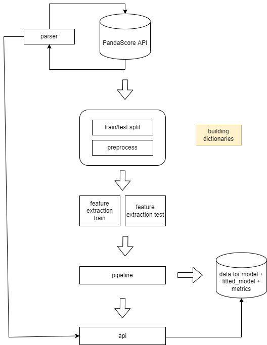
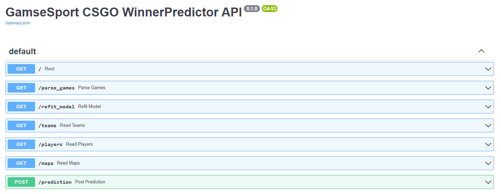

# ПРЕДСКАЗАНИЕ ПОБЕДИТЕЛЯ В ТУРНИРНОЙ ИГРЕ ПО CS:GO

## пайплайн



## методы API



1. GET teams - словарь с командами, участвовавшими в обучении
2. GET players - словарь с игроками, участвовавшими в обучении
3. GET maps - словарь с картами, участвовавшими в обучении
4. GET accuracy - точность модели
4. GET update - дообучение модели на новых играх
5. POST prediction  - вероятность победы команды 1

## структура:

```
.
|____ games
    |____ in
    |____ new_in
    |____ new_out
    |____ not_valid
    |____ out
|____ dictionaries
    |____ team_all_stats_and_location
	|____ team_map_info_stats
	|____ team_game_month_stats
	|____ team_game_hour_stats
	|____ team_all_pair_stats
	|____ player_all_stats
	|____ player_info_passport
	|____ player_map_info_stats
	|____ player_game_month_stats
	|____ player_game_hour_stats
|____ data_model_metrics    
    |____ data_gen
    |____ metrics
    |____ model
    |____ data_train
    |____ data_test
|____ parser.py
|____ pipeline.py
|____ modules
|____ requirements.txt
|____ Dockerfile
|____ README.md

```

## инструкция:
1. установка зависмостей: ```pip install -r requirements.txt```
2. запуск парсера PandaScore: ```parser.py```
3. запуск пайплайна и апи: ```python pipeline.py && uvicorn app:app --reload```